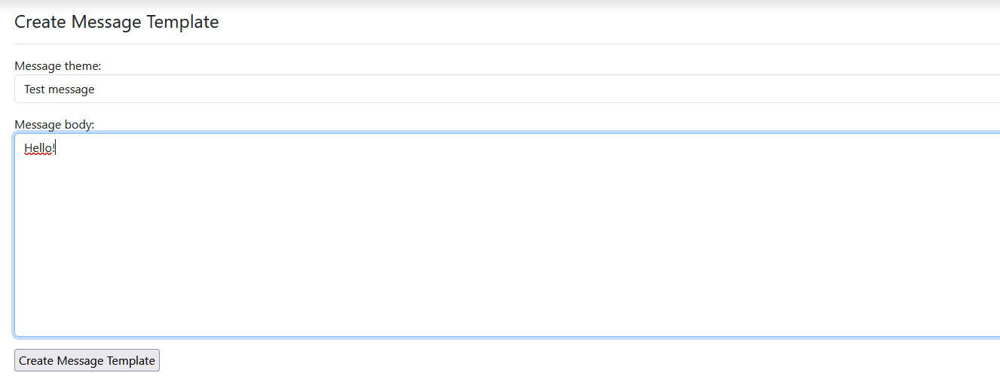

# Education_coursework_6
## WORK WITH DJANGO
### Allow to create scheduler transmission for sending messages to clients
## Requirements.
* Python
* Rest
* Postgres
## Installation
* Download repo
* Install requirements (pip install -r requirements.txt)
* Run service Rest
## Prepare 
* prepare .env file (examples in .env_sample)
* create database for postgres
* prepare migrations (python .\manage.py makemigrations)
* make migrate (python .\manage.py migrate)
* prepare platform (python .\manage.py prepare_platform)
* add test data if you need (python .\manage.py loaddata .\data.json)
* python manage.py crontab add
* python manage.py runserver
## Info about users and groups
After prepare platform you will have 
* groups moderator and users
* user admin@gmail.com (password admin)
* user moderator@gmail.com (password moderator)
* user test@gmail.com (password test)

! If you want to register new user, after creation you should add it to suitable group !

## How it works.
* Create messages (moderators only can see, users have all rights)
* Create clients for sending (moderators only can see, users have all rights)
* Create transmissions for sending (moderators only can see and change published/unpublished status, users have all rights)
* Users can see only theirs own tasks/users/messages
* django_crontab runs schedule function every 1 minute that executes your jobs

## Interface

## Additional
* Author: Avramenko Nikolay
* Date of release: 2023/07/10
